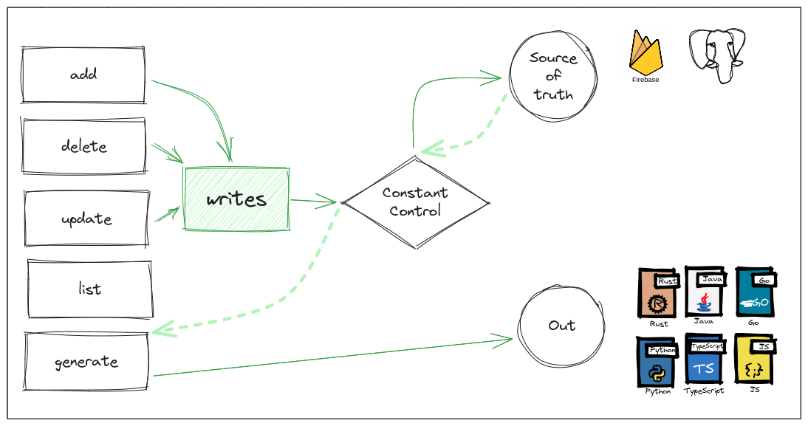

- cli tool
- point to any source file 
    - needs to be a constant file
- ui tool to add and manage constants
- start with js
- use json to maintain raw data
- watch mode

## Abstract

This CLI tool helps developers manage database driven constants that they use in their code. It gives easy commands to add/update/delte the constants which takes effect on the source of truth (like the database); and also syncs your local constant file to include the new key which was added.

### Scenario

Imagine a code like the following, which needs to return a string back, which needs to be read from the database, or some external source.


```javascript
function processOrder() {
    // some business logic
    return {
        data: processOrderResponse,
        message: messageHelper.get("ORDER_PROCESSED", orderId)
    }
}

function betterProcessOrder() {
    // some business logic
    return {
        data: processOrderResponse,
        /* 
         * This is a bit better as it reduces chances of mispelling the key 
         * which may end up being another deployment if not caught early on
         *
         * In the long term, it also helps other devs easily discover 
         * and explore the message codes within the IDE taking full advantage 
         * of the Language Server
         * 
         * However, the drawback is the annoying need to keep these constant files
         * in sync with the database, and lot of times these constant files may
         * lie.
         */
        message: messageHelper.get(MessageCodes.ORDER_PROCESSED, orderId)
    }
}
```


And a table from where this `messageHelper` is resolving these values from

| messageId | messageKey      | messageValue                              | locale |
|-----------|-----------------|-------------------------------------------|--------|
| 1         | ORDER_PROCESSED | Your order #{orderId} has been processed. | en     |
| 2         | ORDER_DELIVERED | Your order #{orderId} has been delivered. | en     |

### Adding a new message

We are aiming to solve the problem (rather annoyence) existing within the `betterProcessOrder` code.
In a scenario like that the steps a developer needs to do to add a new message are:

- Create a new row in the database [ORDER_RETURNED, Your order was successfully picked up for return]
- Create a new constant in the constant file 
- Update some file somewhere to keep track of this new key which is supposed to be added to the database whenever his code gets deployed 

Although the steps are low on count, they can be highly annoying as for each step you'll possibly be using different applications.

### Solution

This tools aims to provide a highly configurable solution which can do all these tasks leaving the developer to focus on their work better. 




## Configuration

```json
{
    "sourceOfTruth": {
        "type": "postgres",
        "conn": {
            "host": "",
            "pass": "",
            "port": "",
            "database": ""
        },
        "hooks": {
            "insert": "insert into messages (messageKey, messageValue) values ($key, $value)", 
            "getKeys": "select messageKey as key, messageValue as value from messages",
            "get": "select messageValue as value from messages where messageKey = $key",
            "delete": "delete from messages where messageKey = $key"
        }
    },
    "sourceOfTruth": {
        "type": "wasm",
        "conn": {
            "host": "./custom_connector.wasm",
        },
        "hooks": {
            "insert": "insert $key $pass", 
            "getKeys": "getKeys",
            "get": "get $key",
            "delete": "delete $key"
        }
    },
    "out": [
        {
            "type": "code",
            "mode": "REWRITE_ALL", // APPEND | REWRITE_ALL
            "opts": {
                "lang": "java",
                "src": [
                    "$HOME/user/workspace/myproj/src/main/java/com/example/myapp/constants/MessageCodes.java",
                ],
            }
        },
        {
            "type": "code",
            "opts": {
                "lang": "go",
                "mode": "REWRITE_ALL", // APPEND | REWRITE_ALL
                "src": [
                    "$HOME/user/workspace/mygoproj/server/constants/messageCodes.go",
                ],
            }
        },
        {
            "type": "code",
            "opts": {
                "lang": "sql",
                "mode": "APPEND", // APPEND | REWRITE_ALL
                "src": [
                    "$HOME/user/workspace/sql-scripts/seed/constants/message-codes.sql",
                ],
            }
        }
    ]
}
```


